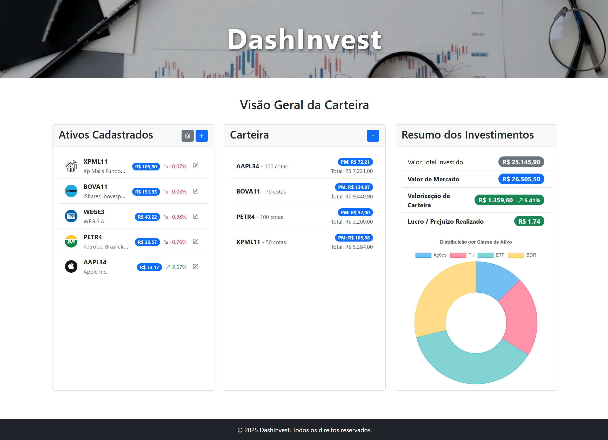

# DashInvest - Dashboard de Investimentos

DashInvest é uma aplicação web de página única (SPA) desenvolvida para auxiliar investidores no acompanhamento de suas carteiras de ações, FIIs, ETFs e BDRs. A plataforma oferece uma visão clara e consolidada dos investimentos, com indicadores de performance e distribuição de ativos em tempo real.

Este projeto representa o front-end da aplicação, construído com JavaScript moderno (vanilla), HTML5 e CSS3, e consome uma API back-end para persistência de dados.



---

## ✨ Funcionalidades Principais

*   **Cadastro de Ativos:** Adicione, edite e remova os ativos que você deseja acompanhar.
*   **Cotações em Tempo Real:** Integração com a API da [Brapi](https://brapi.dev/) para buscar cotações, nomes e logos dos ativos.
*   **Registro de Operações:** Registre suas operações de compra e venda para cada ativo.
*   **Cálculo de Performance:** O sistema calcula automaticamente o preço médio, custo total, lucro/prejuízo realizado e a valorização atual da carteira.
*   **Dashboard Intuitivo:**
    *   **Resumo Financeiro:** Cards com o valor total investido, valor de mercado atual, valorização da carteira e lucro/prejuízo já realizado.
    *   **Visualização Gráfica:** Um gráfico de rosca (doughnut) exibe a distribuição percentual da carteira por classe de ativo.
*   **Modo Offline:** As operações podem ser registradas mesmo que o back-end esteja indisponível, garantindo a continuidade do uso. Os dados são sincronizados quando a conexão é restabelecida.
*   **Configurações Flexíveis:** Permite ativar ou desativar a validação de tickers com a API externa, útil para cenários de teste ou instabilidade da API.

---

## 🚀 Tecnologias Utilizadas

*   **Linguagens:** HTML5, CSS3, JavaScript (ES6+ Modules)
*   **Frameworks e Bibliotecas:**
    *   [Bootstrap 5](https://getbootstrap.com/): Para a estrutura de layout, componentes de UI e design responsivo.
    *   [Chart.js](https://www.chartjs.org/): Para a criação de gráficos interativos.
    *   [Decimal.js](https://github.com/MikeMcl/decimal.js): Para garantir a precisão em todos os cálculos financeiros, evitando erros de ponto flutuante.
*   **APIs Externas:**
    *   **Brapi:** Para obtenção de dados de mercado dos ativos da B3.
    *   **API Back-end própria:** Para persistência dos dados de ativos cadastrados e movimentações da carteira.

---

## 🏛️ Arquitetura

O projeto foi desenvolvido com uma arquitetura modular e reativa, visando a separação de responsabilidades, manutenibilidade e escalabilidade.

*   **`main.js`**: Ponto de entrada da aplicação. Orquestra a inicialização dos módulos e o carregamento dos dados iniciais.

*   **`store.js`**: O coração da aplicação. Funciona como uma **fonte única da verdade** (Single Source of Truth), centralizando todo o estado (lista de ativos e histórico da carteira). Implementa um padrão *Observer (Pub/Sub)*, permitindo que os módulos de UI se "inscrevam" e reajam automaticamente a qualquer mudança no estado.

*   **`apiService.js`**: Módulo de serviço que encapsula toda a comunicação com as APIs (tanto o back-end quanto a Brapi). Isola a lógica de `fetch`, facilitando a manutenção e o tratamento de erros de rede.

*   **Módulos de Funcionalidade (`ativos.js`, `carteira.js`, `resumo.js`):**
    *   Atuam como "controladores" e "views".
    *   São responsáveis por renderizar a UI, manipular eventos do usuário (cliques, submits) e chamar o `apiService` para buscar ou enviar dados.
    *   Quando uma atualização de estado é necessária, eles notificam o `store.js`.
    *   Eles se inscrevem no `store` para serem notificados quando os dados mudam, disparando uma nova renderização da UI de forma reativa.

*   **Módulos de Utilidade (`utils.js`, `configuracoes.js`):**
    *   **`utils.js`**: Contém funções puras e reutilizáveis, como `formatCurrency()` e `showAlert()`.
    *   **`configuracoes.js`**: Gerencia a interatividade do modal de configurações.

Este design desacoplado elimina dependências globais (`window`) e promove um fluxo de dados unidirecional e previsível, inspirado em padrões de frameworks modernos.

---

## 🏁 Como Executar o Projeto

Para executar o DashInvest localmente, você precisará de um servidor web simples para servir os arquivos estáticos e resolver corretamente os módulos JavaScript.

### Pré-requisitos

*   Um navegador web moderno (Chrome, Firefox, Edge).
*   O back-end do DashInvest deve estar em execução.
*   Um editor de código como o VS Code com a extensão Live Server.

### Instalação e Execução

1.  **Clone o repositório:**
    ```bash
    git clone https://github.com/ronaldpedra/PUC-RJ_ronaldpedra_Dev_Full_Stack_Front-end.git
    cd PUC-RJ_ronaldpedra_Dev_Full_Stack_Front-end
    ```

2.  **Configure as APIs:**
    *   Abra o arquivo `js/config.js`.
    *   Ajuste a `API_BASE_URL` para o endereço onde seu back-end está rodando (ex: `http://127.0.0.1:5000`).
    *   A `BRAPI_TOKEN` já está configurada com um token público, mas pode ser substituída se necessário.

3.  **Inicie o servidor:**
    *   Abra a pasta do projeto no VS Code.
    *   Clique com o botão direito no arquivo `index.html`.
    *   Selecione "Open with Live Server".

4.  **Pronto!** A aplicação será aberta no seu navegador.

---

## 📄 Licença

Este projeto está licenciado sob a Licença MIT. Veja o arquivo `LICENSE` para mais detalhes.

---

## 👨‍💻 Autor

*   **Ronald Pedra** - [ronaldpedra (github)](https://github.com/ronaldpedra)

*Agradecimentos especiais ao Gemini Code Assist pela colaboração na arquitetura e refatoração do projeto.*
